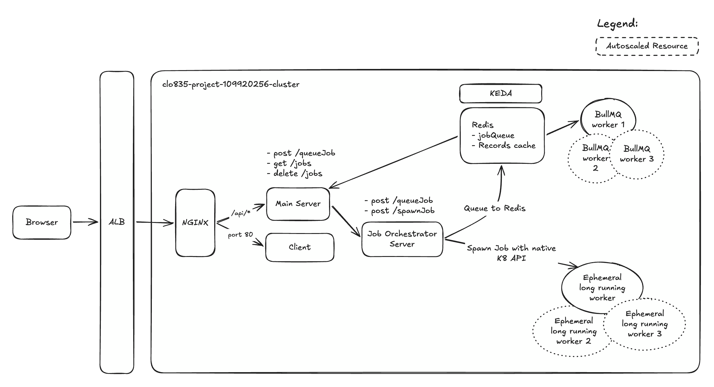

# CLO835 Async Job Orchestration

This repository is a Yarn workspace monorepo that demonstrates asynchronous job handling, queue-backed workers, KEDA scaling, and native Kubernetes API job creation.

## Local Environment Setup

Local Docker Compose runs use a root `.env` file:

```bash
cp .env.example .env
yarn compose:up
```

## AWS Setup

Please refer to `runbook.md` [bootstrapping](runbook.md/#bootstrapping) instructions. It includes setting up the EC2 instance as well as the services.

## Workspace Layout

```text
packages/
  client/                 Vite + TypeScript + MUI client, built into an nginx container
  main-server/            Express service called by the client
  task-orchestrator/      Express service that enqueues BullMQ jobs or creates Kubernetes Jobs
  bullmq-worker/          BullMQ queue worker scaled by KEDA
  ephemeral-worker/       Python one-shot worker image used by orchestrator-created Kubernetes Jobs
  shared/                 Shared TypeScript types, constants and helpers
docker/                   Docker, docker-compose, nginx, and deployment support files
manifests/                Raw Kubernetes YAMLs
evidence/                 Demo transcripts and latency/scale evidence
```

## Architecture

The system runs on a kind cluster hosted on an EC2 instance. The browser client is built as a static site, served by nginx in its own container, and deployed into the same cluster as the backend services. External traffic can enter through an ALB to a nginx reverse proxy that routes to the client and API services (mainly `main-server`) inside the cluster.

Service Diagram:



The client calls the main server only; the main server forwards all work requests to the task orchestrator and responds immediately. It also reads `redis` to for the latest job updates. The client can clear the `redis` cache through the use of a secret.

The orchestrator supports two asynchronous paths:

- Queue jobs: push a BullMQ job to Redis, where queue workers consume jobs and KEDA scales the worker Deployment on Redis queue depth.
- Ephemeral jobs: create a one-shot Kubernetes Job through the native Kubernetes API using the orchestrator ServiceAccount.

It also runs a `cron` to scan and retry "stale" jobs. Job statuses (Records) are managed by workers and the task orchestrator.

## Other Resources

- [Docker Information](./docker/README.md)
- [Bootstrap Script](./bootstrap.sh)
- [Runbook](./runbook.md)
