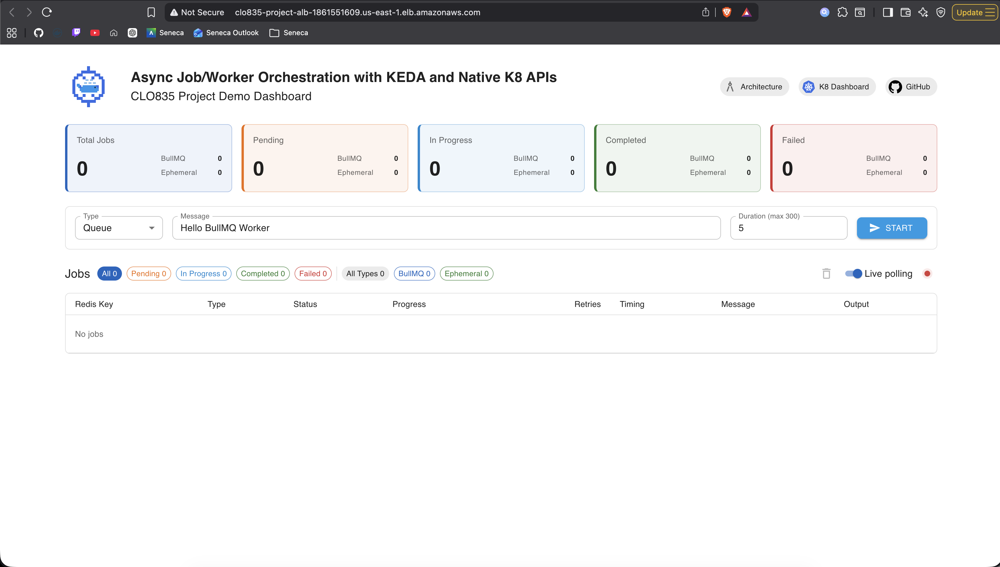
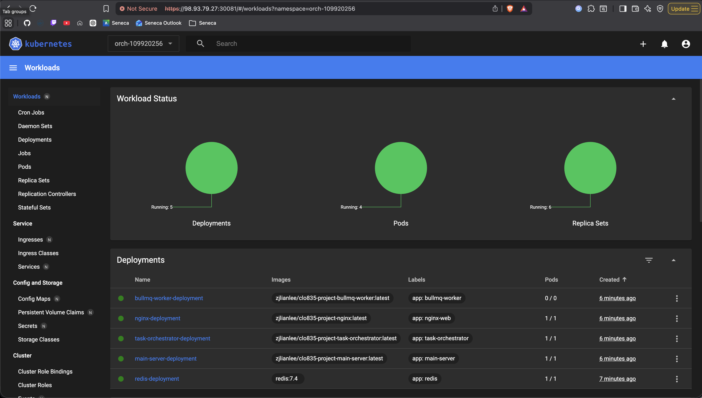
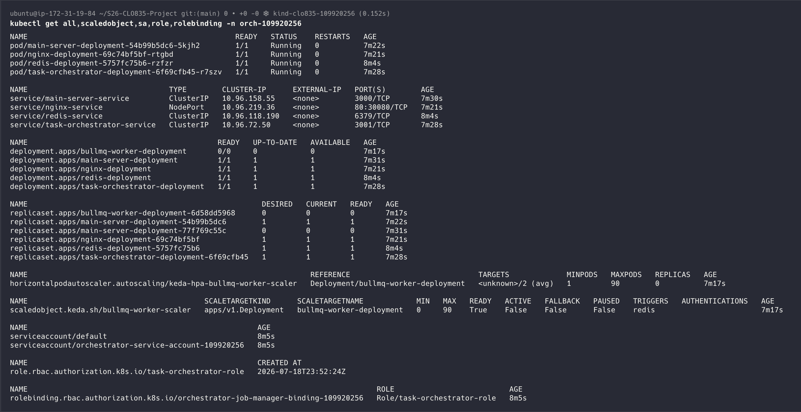

## Evidence log - Bootstrapping

After creating the instance the following command was ran

```bash
git clone https://github.com/zhuojuelee/S26-CLO835-Project.git
cd S26-CLO835-Project
./bootstrap.sh
```

### Screenshots

This section consist of screenshots of the services

#### ALB



#### Kubernetes Dashboard



#### Inital pods



### Bootsrap logs

This section consist of the output logs - The Kubernetes Token was censored

#### Setup output

```bash
Cloning into 'S26-CLO835-Project'...
remote: Enumerating objects: 716, done.
remote: Counting objects: 100% (716/716), done.
remote: Compressing objects: 100% (389/389), done.
remote: Total 716 (delta 358), reused 584 (delta 227), pack-reused 0 (from 0)
Receiving objects: 100% (716/716), 1.07 MiB | 45.80 MiB/s, done.
Resolving deltas: 100% (358/358), done.
=========================================
   BOOTSTRAP INTERACTIVE CONFIGURATION
=========================================

💻 Do you want to deploy the Kubernetes Dashboard? (y/n): y
💻 Do you want to an Application Load Balancer (ALB)? (y/n): y
Please fetch your AWS Credentials from the Lab details page: [AWS Details] --> [AWS CLI] --> [SHOW]

💻 Enter your AWS Access Key:
💻 Enter your AWS Secret Key:
💻 Enter your AWS Session Token:
AWS CLI not found. Installing...
✅ AWS CLI installed successfully

Validating AWS credentials...
✅ AWS credentials are valid

💻 Enter the admin secret. This will be the password to clear the Redis cache:

=========================================
           SUMMARY OF INPUTS
=========================================
🚀 Deploy Dashboard:  true
🌐 Deploy ALB: true
🔑 Admin Secret: ** (Hidden for security)
=========================================
Creating cluster "clo835-109920256" ...
 ✓ Ensuring node image (kindest/node:v1.36.1) 🖼
 ✓ Preparing nodes 📦
 ✓ Writing configuration 📜
 ✓ Starting control-plane 🕹️
 ✓ Installing CNI 🔌
 ✓ Installing StorageClass 💾
 ✓ Waiting ≤ 5m0s for control-plane = Ready ⏳
 • Ready after 18s 💚
Set kubectl context to "kind-clo835-109920256"
You can now use your cluster with:

kubectl cluster-info --context kind-clo835-109920256

Not sure what to do next? 😅  Check out https://kind.sigs.k8s.io/docs/user/quick-start/
Set kubectl context to "kind-clo835-109920256"
📋 System Environment Verification:
  🐳 Docker: 29.1.3 (Client) / 29.1.3 (Server)
  📦 Kind:   v0.32.0
  ☸️  Kube:   Client Version: v1.36.1
-----------------------------------------
NAME                             STATUS   ROLES           AGE   VERSION
clo835-109920256-control-plane   Ready    control-plane   22s   v1.36.1
=================================================================
🏗️  Applying cluster configurations...
=================================================================
namespace/orch-109920256 created
serviceaccount/orchestrator-service-account-109920256 created
role.rbac.authorization.k8s.io/task-orchestrator-role created
rolebinding.rbac.authorization.k8s.io/orchestrator-job-manager-binding-109920256 created
Context "kind-clo835-109920256" modified.
✅ Bootstrap foundation complete.
=================================================================
📦 Applying Redis deployment and service...
=================================================================
deployment.apps/redis-deployment created
service/redis-service created
Waiting for deployment "redis-deployment" rollout to finish: 0 of 1 updated replicas are available...
deployment "redis-deployment" successfully rolled out
⚙️  Installing and setting up KEDA...
customresourcedefinition.apiextensions.k8s.io/scaledobjects.keda.sh condition met
customresourcedefinition.apiextensions.k8s.io/scaledjobs.keda.sh condition met
deployment.apps/keda-admission condition met
deployment.apps/keda-metrics-apiserver condition met
deployment.apps/keda-operator condition met
=================================================================
🔐 ADMIN_SECRET provided, setting up secrets...
=================================================================
secret/admin-secret created
=================================================================
📦 Applying main server deployment and service...
=================================================================
deployment.apps/main-server-deployment created
service/main-server-service created
Waiting for deployment "main-server-deployment" rollout to finish: 0 of 1 updated replicas are available...
deployment "main-server-deployment" successfully rolled out
📦 Applying task orchestrator deployment and service...
deployment.apps/task-orchestrator-deployment created
service/task-orchestrator-service created
Waiting for deployment "task-orchestrator-deployment" rollout to finish: 0 of 1 updated replicas are available...
deployment "task-orchestrator-deployment" successfully rolled out
🧭 Checking Kubernetes Dashboard setup...
=================================================================
📊 Creating Kubernetes Dashboard...
=================================================================
namespace/kubernetes-dashboard created
serviceaccount/kubernetes-dashboard created
service/kubernetes-dashboard created
secret/kubernetes-dashboard-certs created
secret/kubernetes-dashboard-csrf created
secret/kubernetes-dashboard-key-holder created
configmap/kubernetes-dashboard-settings created
role.rbac.authorization.k8s.io/kubernetes-dashboard created
clusterrole.rbac.authorization.k8s.io/kubernetes-dashboard created
rolebinding.rbac.authorization.k8s.io/kubernetes-dashboard created
clusterrolebinding.rbac.authorization.k8s.io/kubernetes-dashboard created
deployment.apps/kubernetes-dashboard created
service/dashboard-metrics-scraper created
deployment.apps/dashboard-metrics-scraper created
Waiting for deployment "kubernetes-dashboard" rollout to finish: 0 of 1 updated replicas are available...
deployment "kubernetes-dashboard" successfully rolled out
service/kubernetes-dashboard patched
🌐 Applying dashboard service changes...
✅ Retrieved EC2 Public IP: 98.93.79.27
=================================================================
🔧 Rolling out main server...
=================================================================
deployment.apps/main-server-deployment env updated
Waiting for deployment spec update to be observed...
Waiting for deployment "main-server-deployment" rollout to finish: 0 out of 1 new replicas have been updated...
Waiting for deployment "main-server-deployment" rollout to finish: 1 old replicas are pending termination...
Waiting for deployment "main-server-deployment" rollout to finish: 1 old replicas are pending termination...
deployment "main-server-deployment" successfully rolled out
=================================================================
📦 Applying nginx deployment and service...
=================================================================
deployment.apps/nginx-deployment created
service/nginx-service created
Waiting for deployment "nginx-deployment" rollout to finish: 0 of 1 updated replicas are available...
deployment "nginx-deployment" successfully rolled out
📦 Applying BullMQ worker deployment and ScaledObject...
deployment.apps/bullmq-worker-deployment created
scaledobject.keda.sh/bullmq-worker-scaler created

Setting up ALB now...
Checking AWS credentials...
✅ Existing AWS credentials detected

Terraform not found. Installing...
✅ Terraform installed successfully
Terraform v1.15.8
on linux_amd64
Detected Instance: i-08098eb3a5b7831b5
Detected Region:   us-east-1
Detected VPC:      vpc-07b2dd6ec664345ed
------------------------------------------------
+ terraform init
Initializing the backend...

Initializing provider plugins...
- Finding latest version of hashicorp/aws...
- Installing hashicorp/aws v6.55.0...
- Installed hashicorp/aws v6.55.0 (signed by HashiCorp)

Terraform has created a lock file .terraform.lock.hcl to record the provider
selections it made above. Include this file in your version control repository
so that Terraform can guarantee to make the same selections by default when
you run "terraform init" in the future.

Terraform has been successfully initialized!

You may now begin working with Terraform. Try running "terraform plan" to see
any changes that are required for your infrastructure. All Terraform commands
should now work.

If you ever set or change modules or backend configuration for Terraform,
rerun this command to reinitialize your working directory. If you forget, other
commands will detect it and remind you to do so if necessary.
+ terraform apply -auto-approve -var-file=terraform.tfvars
data.aws_instance.target_ec2: Reading...
data.aws_subnets.all_vpc_subnets: Reading...
data.aws_subnets.all_vpc_subnets: Read complete after 0s [id=us-east-1]
data.aws_instance.target_ec2: Read complete after 0s [id=i-08098eb3a5b7831b5]

Terraform used the selected providers to generate the following execution plan. Resource actions are indicated with the following symbols:
  + create

Terraform will perform the following actions:

  # aws_lb.alb will be created
  + resource "aws_lb" "alb" {
      + arn                                                          = (known after apply)
      + arn_suffix                                                   = (known after apply)
      + client_keep_alive                                            = 3600
      + desync_mitigation_mode                                       = "defensive"
      + dns_name                                                     = (known after apply)
      + drop_invalid_header_fields                                   = false
      + enable_deletion_protection                                   = false
      + enable_http2                                                 = true
      + enable_prefix_for_ipv6_source_nat                            = (known after apply)
      + enable_tls_version_and_cipher_suite_headers                  = false
      + enable_waf_fail_open                                         = false
      + enable_xff_client_port                                       = false
      + enable_zonal_shift                                           = false
      + enforce_security_group_inbound_rules_on_private_link_traffic = (known after apply)
      + id                                                           = (known after apply)
      + idle_timeout                                                 = 60
      + internal                                                     = false
      + ip_address_type                                              = (known after apply)
      + load_balancer_type                                           = "application"
      + name                                                         = "clo835-project-alb"
      + name_prefix                                                  = (known after apply)
      + preserve_host_header                                         = false
      + region                                                       = "us-east-1"
      + secondary_ips_auto_assigned_per_subnet                       = (known after apply)
      + security_groups                                              = (known after apply)
      + subnets                                                      = [
          + "subnet-0895a6f7d72f7592c",
          + "subnet-0d14e54e7d3da584e",
        ]
      + tags_all                                                     = (known after apply)
      + vpc_id                                                       = (known after apply)
      + xff_header_processing_mode                                   = "append"
      + zone_id                                                      = (known after apply)

      + subnet_mapping (known after apply)
    }

  # aws_lb_listener.http will be created
  + resource "aws_lb_listener" "http" {
      + arn                                                                   = (known after apply)
      + id                                                                    = (known after apply)
      + load_balancer_arn                                                     = (known after apply)
      + port                                                                  = 80
      + protocol                                                              = "HTTP"
      + region                                                                = "us-east-1"
      + routing_http_request_x_amzn_mtls_clientcert_header_name               = (known after apply)
      + routing_http_request_x_amzn_mtls_clientcert_issuer_header_name        = (known after apply)
      + routing_http_request_x_amzn_mtls_clientcert_leaf_header_name          = (known after apply)
      + routing_http_request_x_amzn_mtls_clientcert_serial_number_header_name = (known after apply)
      + routing_http_request_x_amzn_mtls_clientcert_subject_header_name       = (known after apply)
      + routing_http_request_x_amzn_mtls_clientcert_validity_header_name      = (known after apply)
      + routing_http_request_x_amzn_tls_cipher_suite_header_name              = (known after apply)
      + routing_http_request_x_amzn_tls_version_header_name                   = (known after apply)
      + routing_http_response_access_control_allow_credentials_header_value   = (known after apply)
      + routing_http_response_access_control_allow_headers_header_value       = (known after apply)
      + routing_http_response_access_control_allow_methods_header_value       = (known after apply)
      + routing_http_response_access_control_allow_origin_header_value        = (known after apply)
      + routing_http_response_access_control_expose_headers_header_value      = (known after apply)
      + routing_http_response_access_control_max_age_header_value             = (known after apply)
      + routing_http_response_content_security_policy_header_value            = (known after apply)
      + routing_http_response_server_enabled                                  = (known after apply)
      + routing_http_response_strict_transport_security_header_value          = (known after apply)
      + routing_http_response_x_content_type_options_header_value             = (known after apply)
      + routing_http_response_x_frame_options_header_value                    = (known after apply)
      + ssl_policy                                                            = (known after apply)
      + tags_all                                                              = (known after apply)
      + tcp_idle_timeout_seconds                                              = (known after apply)

      + default_action {
          + order            = (known after apply)
          + target_group_arn = (known after apply)
          + type             = "forward"
        }

      + mutual_authentication (known after apply)
    }

  # aws_lb_target_group.tg will be created
  + resource "aws_lb_target_group" "tg" {
      + arn                                = (known after apply)
      + arn_suffix                         = (known after apply)
      + connection_termination             = (known after apply)
      + deregistration_delay               = "300"
      + id                                 = (known after apply)
      + ip_address_type                    = (known after apply)
      + lambda_multi_value_headers_enabled = false
      + load_balancer_arns                 = (known after apply)
      + load_balancing_algorithm_type      = (known after apply)
      + load_balancing_anomaly_mitigation  = (known after apply)
      + load_balancing_cross_zone_enabled  = (known after apply)
      + name                               = "clo835-project-tg"
      + name_prefix                        = (known after apply)
      + port                               = 30080
      + preserve_client_ip                 = (known after apply)
      + protocol                           = "HTTP"
      + protocol_version                   = (known after apply)
      + proxy_protocol_v2                  = false
      + region                             = "us-east-1"
      + slow_start                         = 0
      + tags_all                           = (known after apply)
      + target_type                        = "instance"
      + vpc_id                             = "vpc-07b2dd6ec664345ed"

      + health_check (known after apply)

      + stickiness (known after apply)

      + target_failover (known after apply)

      + target_group_health (known after apply)

      + target_health_state (known after apply)
    }

  # aws_lb_target_group_attachment.tg_attachment will be created
  + resource "aws_lb_target_group_attachment" "tg_attachment" {
      + id               = (known after apply)
      + port             = 30080
      + region           = "us-east-1"
      + target_group_arn = (known after apply)
      + target_id        = "i-08098eb3a5b7831b5"
    }

  # aws_security_group.alb_sg will be created
  + resource "aws_security_group" "alb_sg" {
      + arn                    = (known after apply)
      + description            = "Managed by Terraform"
      + egress                 = [
          + {
              + cidr_blocks      = [
                  + "0.0.0.0/0",
                ]
              + from_port        = 0
              + ipv6_cidr_blocks = []
              + prefix_list_ids  = []
              + protocol         = "-1"
              + security_groups  = []
              + self             = false
              + to_port          = 0
                # (1 unchanged attribute hidden)
            },
        ]
      + id                     = (known after apply)
      + ingress                = [
          + {
              + cidr_blocks      = [
                  + "0.0.0.0/0",
                ]
              + from_port        = 80
              + ipv6_cidr_blocks = []
              + prefix_list_ids  = []
              + protocol         = "tcp"
              + security_groups  = []
              + self             = false
              + to_port          = 80
                # (1 unchanged attribute hidden)
            },
        ]
      + name                   = "clo835-project-alb-sg"
      + name_prefix            = (known after apply)
      + owner_id               = (known after apply)
      + region                 = "us-east-1"
      + revoke_rules_on_delete = false
      + tags_all               = (known after apply)
      + vpc_id                 = "vpc-07b2dd6ec664345ed"
    }

Plan: 5 to add, 0 to change, 0 to destroy.

Changes to Outputs:
  + alb_url = (known after apply)
aws_security_group.alb_sg: Creating...
aws_lb_target_group.tg: Creating...
aws_lb_target_group.tg: Creation complete after 0s [id=arn:aws:elasticloadbalancing:us-east-1:659683091809:targetgroup/clo835-project-tg/870742a4eacaad30]
aws_lb_target_group_attachment.tg_attachment: Creating...
aws_lb_target_group_attachment.tg_attachment: Creation complete after 1s [id=arn:aws:elasticloadbalancing:us-east-1:659683091809:targetgroup/clo835-project-tg/870742a4eacaad30,i-08098eb3a5b7831b5,30080]
aws_security_group.alb_sg: Creation complete after 2s [id=sg-02b126ee01b35a36f]
aws_lb.alb: Creating...
aws_lb.alb: Still creating... [00m10s elapsed]
aws_lb.alb: Still creating... [00m20s elapsed]
aws_lb.alb: Still creating... [00m30s elapsed]
aws_lb.alb: Still creating... [00m40s elapsed]
aws_lb.alb: Still creating... [00m50s elapsed]
aws_lb.alb: Still creating... [01m00s elapsed]
aws_lb.alb: Still creating... [01m10s elapsed]
aws_lb.alb: Still creating... [01m20s elapsed]
aws_lb.alb: Still creating... [01m30s elapsed]
aws_lb.alb: Still creating... [01m40s elapsed]
aws_lb.alb: Still creating... [01m50s elapsed]
aws_lb.alb: Still creating... [02m00s elapsed]
aws_lb.alb: Still creating... [02m10s elapsed]
aws_lb.alb: Still creating... [02m20s elapsed]
aws_lb.alb: Still creating... [02m30s elapsed]
aws_lb.alb: Still creating... [02m40s elapsed]
aws_lb.alb: Still creating... [02m50s elapsed]
aws_lb.alb: Still creating... [03m00s elapsed]
aws_lb.alb: Creation complete after 3m2s [id=arn:aws:elasticloadbalancing:us-east-1:659683091809:loadbalancer/app/clo835-project-alb/ed2cad9c4db3ec69]
aws_lb_listener.http: Creating...
aws_lb_listener.http: Creation complete after 0s [id=arn:aws:elasticloadbalancing:us-east-1:659683091809:listener/app/clo835-project-alb/ed2cad9c4db3ec69/e87df3c3d1fd938e]

Apply complete! Resources: 5 added, 0 changed, 0 destroyed.

Outputs:

alb_url = "http://clo835-project-alb-1861551609.us-east-1.elb.amazonaws.com"

=========================================
                ALB URL
=========================================

http://clo835-project-alb-1861551609.us-east-1.elb.amazonaws.com


=========================================
       Kubernetes Dashboard Token
=========================================

<token_censored>

```
