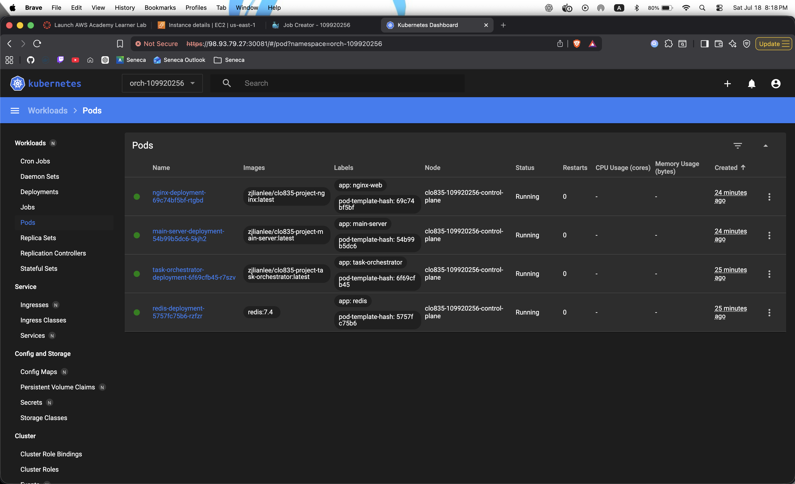
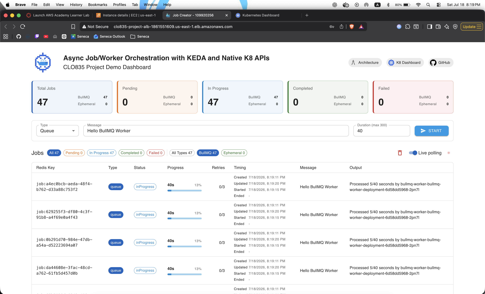
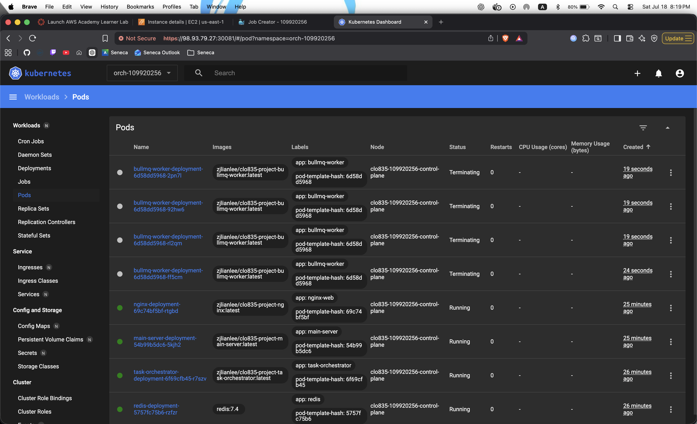

## Evidence - Post an ephemeral job and show the orchestrator-created Kubernetes Job and Pod

### Screenshots

This section consist of the screenshots of the process

#### Kubernetes Dashboard BEFORE burst - 8:18pm

#### Posting a burst of BullMQ jobs

#### Kubernetes Dashboard AFTER burst - 8:19pm

