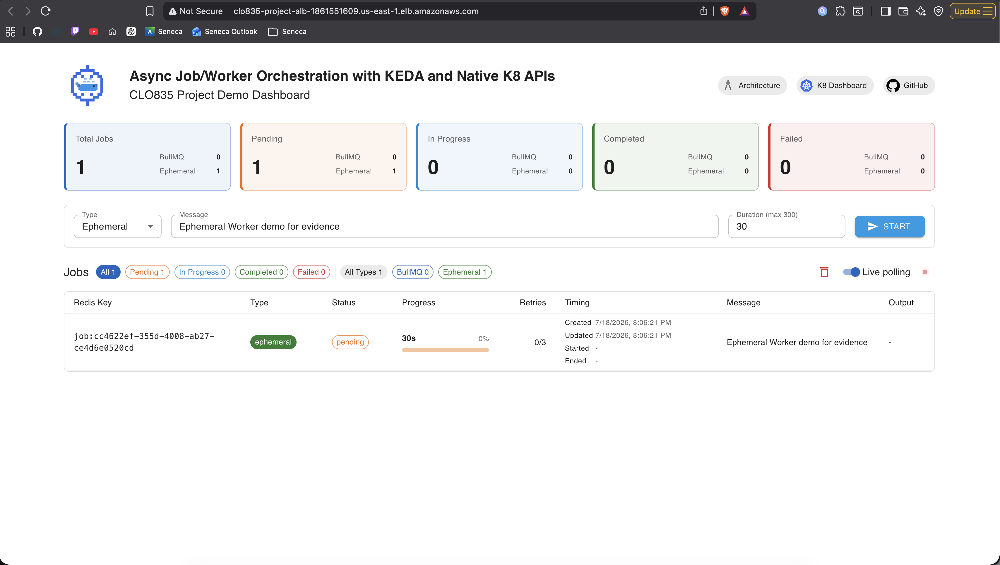
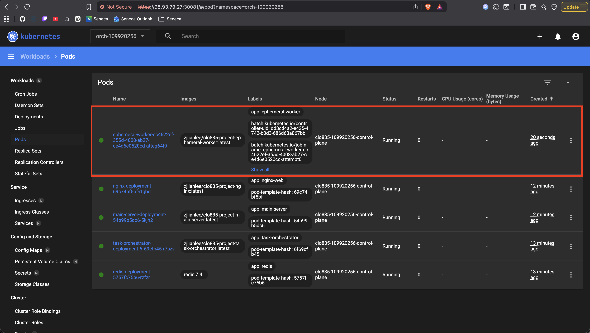
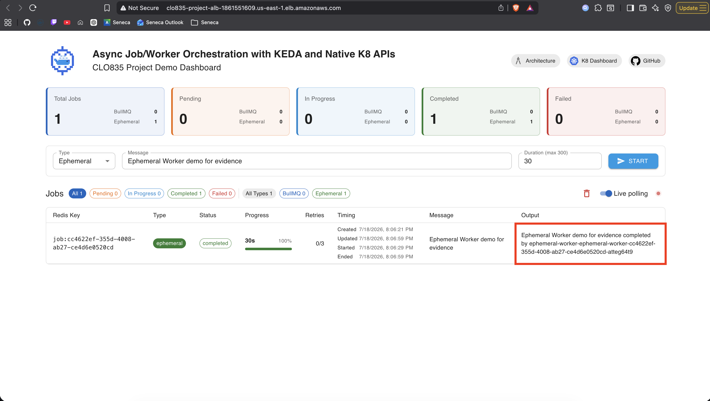

## Evidence log - Post an ephemeral job and show the orchestrator-created Kubernetes Job and Pod

### Screenshots

This section consist of screenshots of the process

#### Kicking off the job

#### Observing the new pod

> [!IMPORTANT]
> Pay attention to the worker pod ID

#### The finished job

> [!IMPORTANT]
> Pay attention to the worker pod ID

