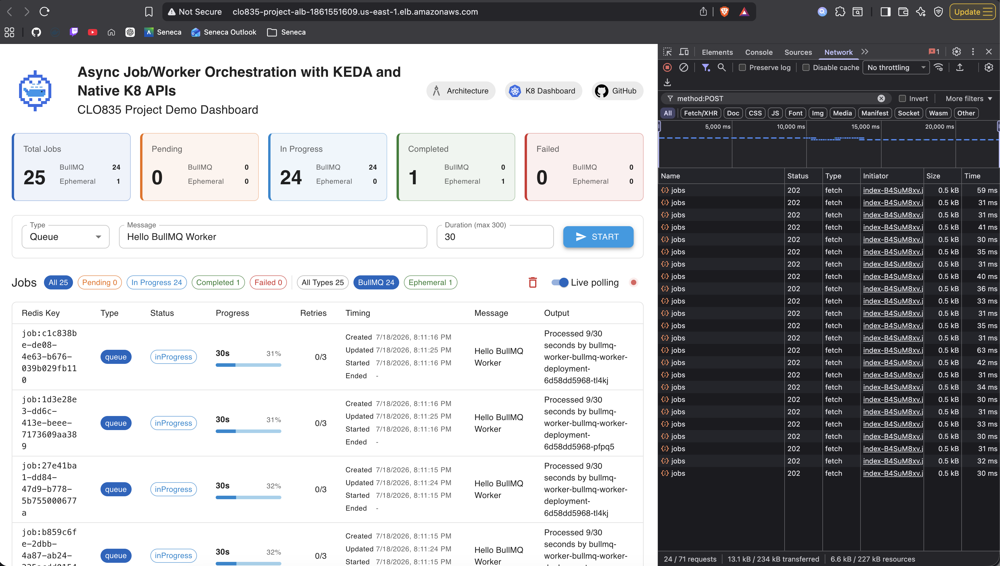

## Evidence log - Prove the main server stays responsive during queue and ephemeral load

### Screenshots

#### Posting a burst of BullMQ jobs and filtering the network calls in the chrome debug tool with `method:POST` to get `POST /jobs` only

> [!IMPORTANT]
> Notice even if the job runs for 30 seconds, the response is instantaneous from the server. All of them took < 70ms to respond

