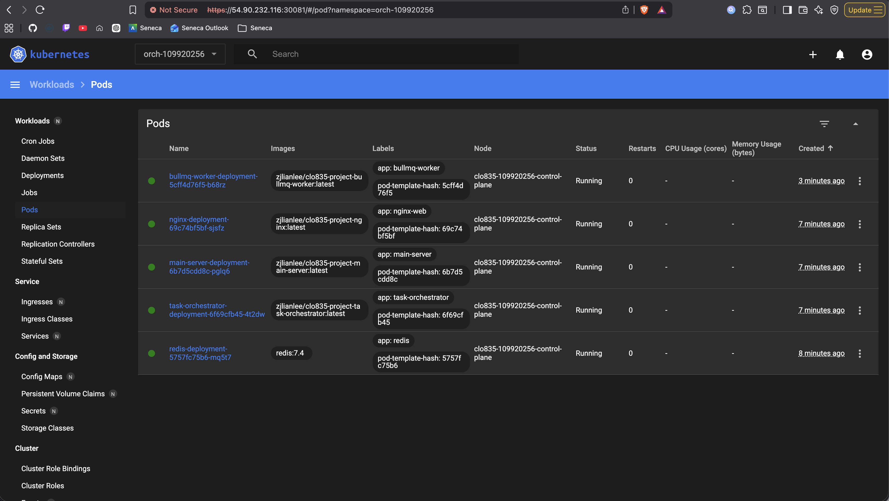
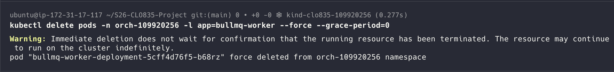
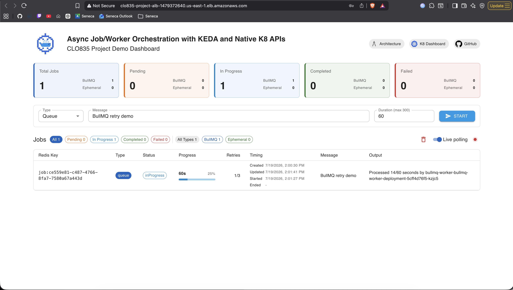
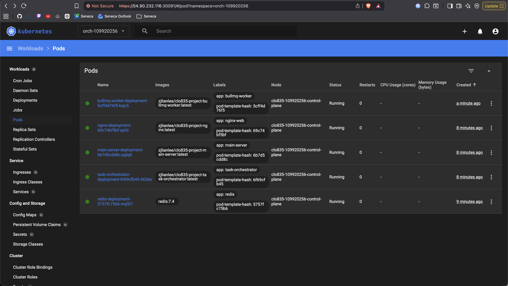
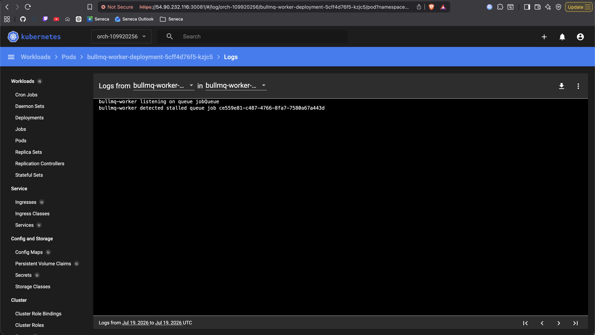
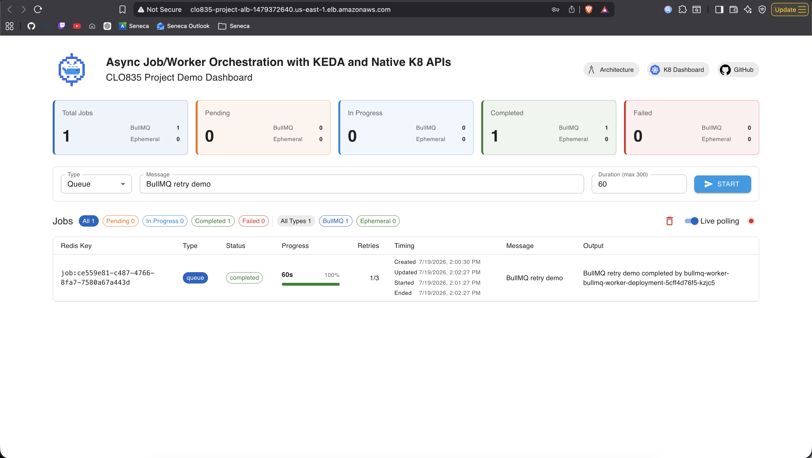
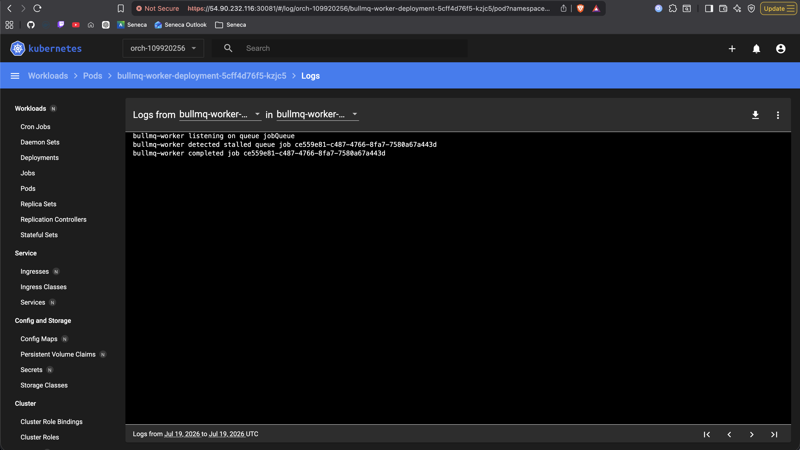

## Evidence log - Kill a BullMQ worker Pod mid-drain and show the queue job is retried or reclaimed

### Screenshots

#### Starting the job

> [!NOTE]
> Trace:
>
> - JobID: `job:ce559e81-c487-4766-8fa7-7580a67a443d`
> - Worker Pod: `bullmq-worker-deployment-5cff4d76f5-b68rz`

Start of the job

#### Deleting the pod

> [!NOTE]
> Trace:
>
> - JobID: `job:ce559e81-c487-4766-8fa7-7580a67a443d`
> - Worker Pod: `bullmq-worker-deployment-5cff4d76f5-b68rz`

Killing the pod

#### Retry kicking in

> [!NOTE]
> Trace:
>
> - JobID: `job:ce559e81-c487-4766-8fa7-7580a67a443d`
> - Worker Pod: `bullmq-worker-deployment-5cff4d76f5-kzjc5` (new)
>
> Notice at the output message

Observing the process

Observing new pod and its logs

#### Results

> [!NOTE]
> Trace:
>
> - JobID: `job:ce559e81-c487-4766-8fa7-7580a67a443d`
> - Worker Pod: `bullmq-worker-deployment-5cff4d76f5-kzjc5`

