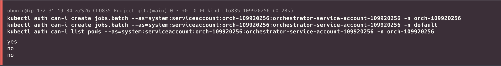

## Evidence log - Inspect and explain the orchestrator RBAC. Prove it can create jobs in `orch-109920256` and prove it cannot act in any other space

### Screenshots

#### RBAC results from commands



### Log output

```bash
kubectl auth can-i create jobs.batch --as=system:serviceaccount:orch-109920256:orchestrator-service-account-109920256 -n orch-109920256
kubectl auth can-i create jobs.batch --as=system:serviceaccount:orch-109920256:orchestrator-service-account-109920256 -n default
kubectl auth can-i list pods --as=system:serviceaccount:orch-109920256:orchestrator-service-account-109920256 -n orch-109920256
yes
no
no
```
