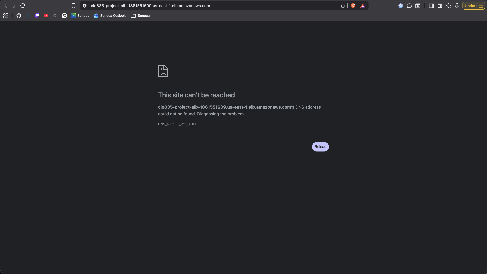
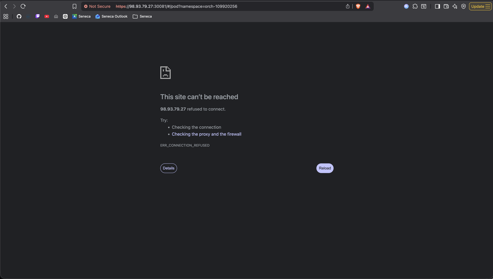
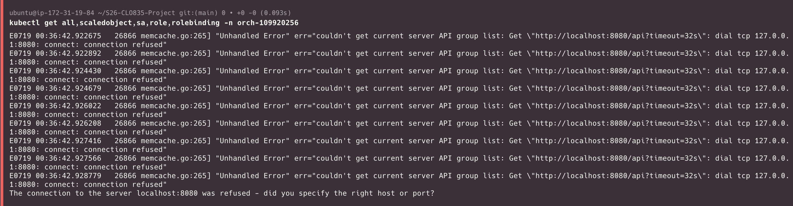

## Evidence log - Tear down the project and confirm no leftover resources remain

### Screenshots

#### ALB after teardown



#### Kubernetes Dashboard after teardown



#### Cluster status after teardown

Command - `kubectl get all,scaledobject,sa,role,rolebinding -n orch-109920256`



### Output logs

This section consist of the output logs after running:

```bash
kind delete cluster --name clo835-109920256
terraform -chdir=terraform destroy -auto-approve -var-file=terraform.tfvars
```

Output:

```bash
Deleting cluster "clo835-109920256" ...
Deleted nodes: ["clo835-109920256-control-plane"]
aws_security_group.alb_sg: Refreshing state... [id=sg-02b126ee01b35a36f]
data.aws_subnets.all_vpc_subnets: Reading...
data.aws_instance.target_ec2: Reading...
aws_lb_target_group.tg: Refreshing state... [id=arn:aws:elasticloadbalancing:us-east-1:659683091809:targetgroup/clo835-project-tg/870742a4eacaad30]
aws_lb_target_group_attachment.tg_attachment: Refreshing state... [id=arn:aws:elasticloadbalancing:us-east-1:659683091809:targetgroup/clo835-project-tg/870742a4eacaad30,i-08098eb3a5b7831b5,30080]
data.aws_subnets.all_vpc_subnets: Read complete after 0s [id=us-east-1]
data.aws_instance.target_ec2: Read complete after 1s [id=i-08098eb3a5b7831b5]
aws_lb.alb: Refreshing state... [id=arn:aws:elasticloadbalancing:us-east-1:659683091809:loadbalancer/app/clo835-project-alb/ed2cad9c4db3ec69]
aws_lb_listener.http: Refreshing state... [id=arn:aws:elasticloadbalancing:us-east-1:659683091809:listener/app/clo835-project-alb/ed2cad9c4db3ec69/e87df3c3d1fd938e]

Terraform used the selected providers to generate the following execution plan. Resource actions are indicated with the following symbols:
  - destroy

Terraform will perform the following actions:

  # aws_lb.alb will be destroyed
  - resource "aws_lb" "alb" {
      - arn                                                          = "arn:aws:elasticloadbalancing:us-east-1:659683091809:loadbalancer/app/clo835-project-alb/ed2cad9c4db3ec69" -> null
      - arn_suffix                                                   = "app/clo835-project-alb/ed2cad9c4db3ec69" -> null
      - client_keep_alive                                            = 3600 -> null
      - desync_mitigation_mode                                       = "defensive" -> null
      - dns_name                                                     = "clo835-project-alb-1861551609.us-east-1.elb.amazonaws.com" -> null
      - drop_invalid_header_fields                                   = false -> null
      - enable_cross_zone_load_balancing                             = true -> null
      - enable_deletion_protection                                   = false -> null
      - enable_http2                                                 = true -> null
      - enable_prefix_for_ipv6_source_nat                            = "off" -> null
      - enable_tls_version_and_cipher_suite_headers                  = false -> null
      - enable_waf_fail_open                                         = false -> null
      - enable_xff_client_port                                       = false -> null
      - enable_zonal_shift                                           = false -> null
      - id                                                           = "arn:aws:elasticloadbalancing:us-east-1:659683091809:loadbalancer/app/clo835-project-alb/ed2cad9c4db3ec69" -> null
      - idle_timeout                                                 = 60 -> null
      - internal                                                     = false -> null
      - ip_address_type                                              = "ipv4" -> null
      - load_balancer_type                                           = "application" -> null
      - name                                                         = "clo835-project-alb" -> null
      - preserve_host_header                                         = false -> null
      - region                                                       = "us-east-1" -> null
      - security_groups                                              = [
          - "sg-02b126ee01b35a36f",
        ] -> null
      - subnets                                                      = [
          - "subnet-0895a6f7d72f7592c",
          - "subnet-0d14e54e7d3da584e",
        ] -> null
      - tags                                                         = {} -> null
      - tags_all                                                     = {} -> null
      - vpc_id                                                       = "vpc-07b2dd6ec664345ed" -> null
      - xff_header_processing_mode                                   = "append" -> null
      - zone_id                                                      = "Z35SXDOTRQ7X7K" -> null
        # (3 unchanged attributes hidden)

      - access_logs {
          - enabled = false -> null
            # (2 unchanged attributes hidden)
        }

      - connection_logs {
          - enabled = false -> null
            # (2 unchanged attributes hidden)
        }

      - health_check_logs {
          - enabled = false -> null
            # (2 unchanged attributes hidden)
        }

      - subnet_mapping {
          - subnet_id            = "subnet-0895a6f7d72f7592c" -> null
            # (4 unchanged attributes hidden)
        }
      - subnet_mapping {
          - subnet_id            = "subnet-0d14e54e7d3da584e" -> null
            # (4 unchanged attributes hidden)
        }
    }

  # aws_lb_listener.http will be destroyed
  - resource "aws_lb_listener" "http" {
      - arn                                                                 = "arn:aws:elasticloadbalancing:us-east-1:659683091809:listener/app/clo835-project-alb/ed2cad9c4db3ec69/e87df3c3d1fd938e" -> null
      - id                                                                  = "arn:aws:elasticloadbalancing:us-east-1:659683091809:listener/app/clo835-project-alb/ed2cad9c4db3ec69/e87df3c3d1fd938e" -> null
      - load_balancer_arn                                                   = "arn:aws:elasticloadbalancing:us-east-1:659683091809:loadbalancer/app/clo835-project-alb/ed2cad9c4db3ec69" -> null
      - port                                                                = 80 -> null
      - protocol                                                            = "HTTP" -> null
      - region                                                              = "us-east-1" -> null
      - routing_http_response_server_enabled                                = true -> null
      - tags                                                                = {} -> null
      - tags_all                                                            = {} -> null
        # (11 unchanged attributes hidden)

      - default_action {
          - order            = 1 -> null
          - target_group_arn = "arn:aws:elasticloadbalancing:us-east-1:659683091809:targetgroup/clo835-project-tg/870742a4eacaad30" -> null
          - type             = "forward" -> null
        }
    }

  # aws_lb_target_group.tg will be destroyed
  - resource "aws_lb_target_group" "tg" {
      - arn                                = "arn:aws:elasticloadbalancing:us-east-1:659683091809:targetgroup/clo835-project-tg/870742a4eacaad30" -> null
      - arn_suffix                         = "targetgroup/clo835-project-tg/870742a4eacaad30" -> null
      - deregistration_delay               = "300" -> null
      - id                                 = "arn:aws:elasticloadbalancing:us-east-1:659683091809:targetgroup/clo835-project-tg/870742a4eacaad30" -> null
      - ip_address_type                    = "ipv4" -> null
      - lambda_multi_value_headers_enabled = false -> null
      - load_balancer_arns                 = [
          - "arn:aws:elasticloadbalancing:us-east-1:659683091809:loadbalancer/app/clo835-project-alb/ed2cad9c4db3ec69",
        ] -> null
      - load_balancing_algorithm_type      = "round_robin" -> null
      - load_balancing_anomaly_mitigation  = "off" -> null
      - load_balancing_cross_zone_enabled  = "use_load_balancer_configuration" -> null
      - name                               = "clo835-project-tg" -> null
      - port                               = 30080 -> null
      - protocol                           = "HTTP" -> null
      - protocol_version                   = "HTTP1" -> null
      - proxy_protocol_v2                  = false -> null
      - region                             = "us-east-1" -> null
      - slow_start                         = 0 -> null
      - tags                               = {} -> null
      - tags_all                           = {} -> null
      - target_control_port                = 0 -> null
      - target_type                        = "instance" -> null
      - vpc_id                             = "vpc-07b2dd6ec664345ed" -> null
        # (1 unchanged attribute hidden)

      - health_check {
          - enabled             = true -> null
          - healthy_threshold   = 5 -> null
          - interval            = 30 -> null
          - matcher             = "200" -> null
          - path                = "/" -> null
          - port                = "traffic-port" -> null
          - protocol            = "HTTP" -> null
          - timeout             = 5 -> null
          - unhealthy_threshold = 2 -> null
        }

      - stickiness {
          - cookie_duration = 86400 -> null
          - enabled         = false -> null
          - type            = "lb_cookie" -> null
            # (1 unchanged attribute hidden)
        }

      - target_failover {}

      - target_group_health {
          - dns_failover {
              - minimum_healthy_targets_count      = "1" -> null
              - minimum_healthy_targets_percentage = "off" -> null
            }
          - unhealthy_state_routing {
              - minimum_healthy_targets_count      = 1 -> null
              - minimum_healthy_targets_percentage = "off" -> null
            }
        }

      - target_health_state {}
    }

  # aws_lb_target_group_attachment.tg_attachment will be destroyed
  - resource "aws_lb_target_group_attachment" "tg_attachment" {
      - id               = "arn:aws:elasticloadbalancing:us-east-1:659683091809:targetgroup/clo835-project-tg/870742a4eacaad30,i-08098eb3a5b7831b5,30080" -> null
      - port             = 30080 -> null
      - region           = "us-east-1" -> null
      - target_group_arn = "arn:aws:elasticloadbalancing:us-east-1:659683091809:targetgroup/clo835-project-tg/870742a4eacaad30" -> null
      - target_id        = "i-08098eb3a5b7831b5" -> null
    }

  # aws_security_group.alb_sg will be destroyed
  - resource "aws_security_group" "alb_sg" {
      - arn                    = "arn:aws:ec2:us-east-1:659683091809:security-group/sg-02b126ee01b35a36f" -> null
      - description            = "Managed by Terraform" -> null
      - egress                 = [
          - {
              - cidr_blocks      = [
                  - "0.0.0.0/0",
                ]
              - from_port        = 0
              - ipv6_cidr_blocks = []
              - prefix_list_ids  = []
              - protocol         = "-1"
              - security_groups  = []
              - self             = false
              - to_port          = 0
                # (1 unchanged attribute hidden)
            },
        ] -> null
      - id                     = "sg-02b126ee01b35a36f" -> null
      - ingress                = [
          - {
              - cidr_blocks      = [
                  - "0.0.0.0/0",
                ]
              - from_port        = 80
              - ipv6_cidr_blocks = []
              - prefix_list_ids  = []
              - protocol         = "tcp"
              - security_groups  = []
              - self             = false
              - to_port          = 80
                # (1 unchanged attribute hidden)
            },
        ] -> null
      - name                   = "clo835-project-alb-sg" -> null
      - owner_id               = "659683091809" -> null
      - region                 = "us-east-1" -> null
      - revoke_rules_on_delete = false -> null
      - tags                   = {} -> null
      - tags_all               = {} -> null
      - vpc_id                 = "vpc-07b2dd6ec664345ed" -> null
        # (1 unchanged attribute hidden)
    }

Plan: 0 to add, 0 to change, 5 to destroy.

Changes to Outputs:
  - alb_url = "http://clo835-project-alb-1861551609.us-east-1.elb.amazonaws.com" -> null
aws_lb_target_group_attachment.tg_attachment: Destroying... [id=arn:aws:elasticloadbalancing:us-east-1:659683091809:targetgroup/clo835-project-tg/870742a4eacaad30,i-08098eb3a5b7831b5,30080]
aws_lb_listener.http: Destroying... [id=arn:aws:elasticloadbalancing:us-east-1:659683091809:listener/app/clo835-project-alb/ed2cad9c4db3ec69/e87df3c3d1fd938e]
aws_lb_target_group_attachment.tg_attachment: Destruction complete after 0s
aws_lb_listener.http: Destruction complete after 0s
aws_lb_target_group.tg: Destroying... [id=arn:aws:elasticloadbalancing:us-east-1:659683091809:targetgroup/clo835-project-tg/870742a4eacaad30]
aws_lb.alb: Destroying... [id=arn:aws:elasticloadbalancing:us-east-1:659683091809:loadbalancer/app/clo835-project-alb/ed2cad9c4db3ec69]
aws_lb_target_group.tg: Destruction complete after 0s
aws_lb.alb: Still destroying... [id=arn:aws:elasticloadbalancing:us-east-1:...pp/clo835-project-alb/ed2cad9c4db3ec69, 00m10s elapsed]
aws_lb.alb: Destruction complete after 16s
aws_security_group.alb_sg: Destroying... [id=sg-02b126ee01b35a36f]
aws_security_group.alb_sg: Destruction complete after 5s

Destroy complete! Resources: 5 destroyed.
```
